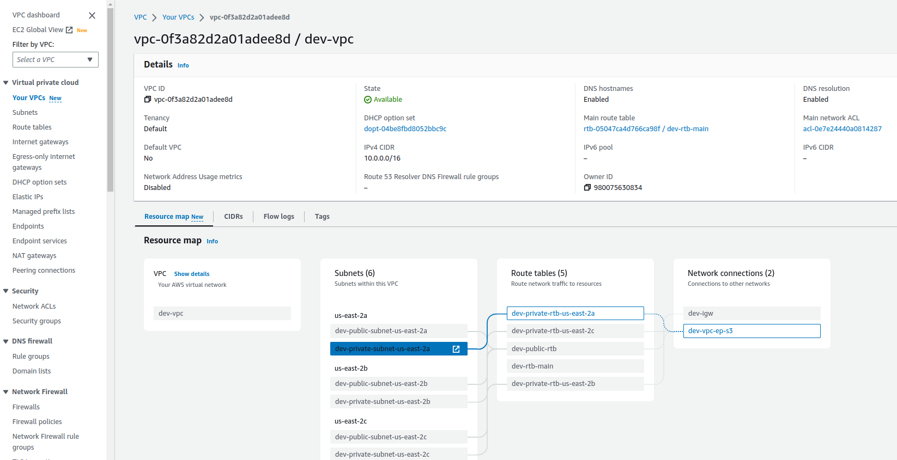
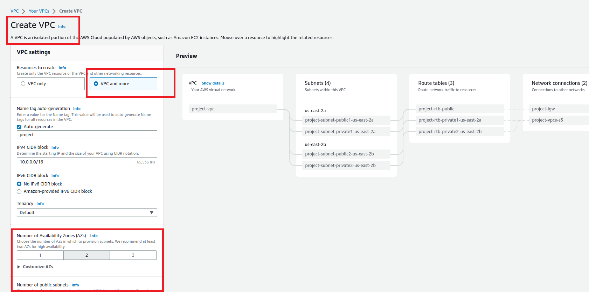

# Examples/samples to build AWS VPCs

**This repo is an example on how to build a VPC using Terraform with: **
**(Just like the "Create VPC and more" button in the AWS Console)**
- 1..n AZs
- public and private subnets in each AZ
- an internet gateway for the public subnets
- route tables and routes for the public and private subnets
- an S3 endpoint that the private routes route to
- an EC2 Ubuntu host on each public subnet with docker installed
- It will output the Public IPs of the hosts at the end of the build for you
- You will have to create a key pair to SSH into the nodes if you want and update the name of the key in the code.  I'm sure you can find it.
- You will have to export an environment variable called TF_VAR_my_internet_ip=<your internet IP> if you want the security group to work properly
- You can control the number of AZs and CIDR blocks by modifying the values in **terraform.tfvars**

Thanks to [Derek Morgan and his YouTube video](https://youtu.be/iRaai1IBlB0) that taught me the Terraform basics.

  **Sample output of Terraform plan:**
  
  

**Basically, this terraform plan does the same thing as if you clicked on this in the AWS Console: (except you get Ubuntu hosts with this plan)**
  

Additionally - similar functionality but pretty weak scripts included here in the same repo:
- buildaws.sh  - shell script just calling the AWS CLI
- buildaws.py  - python script just calling the AWS CLI
- build_aws_with_boto3.py   - python script using boto3 to make the API calls directly

